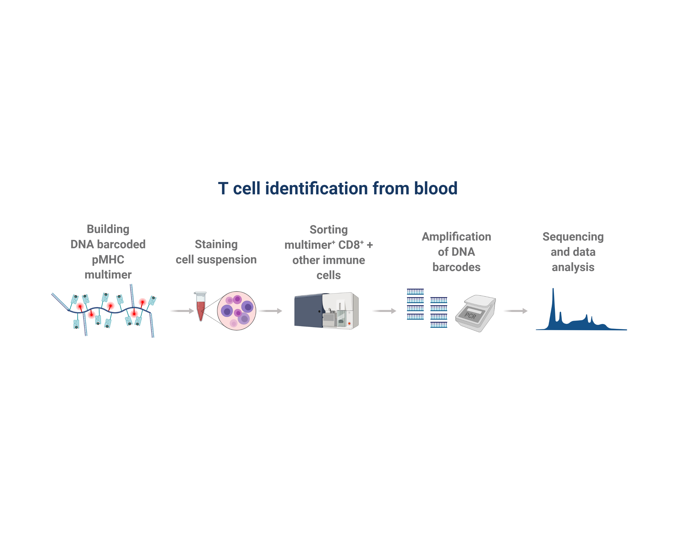
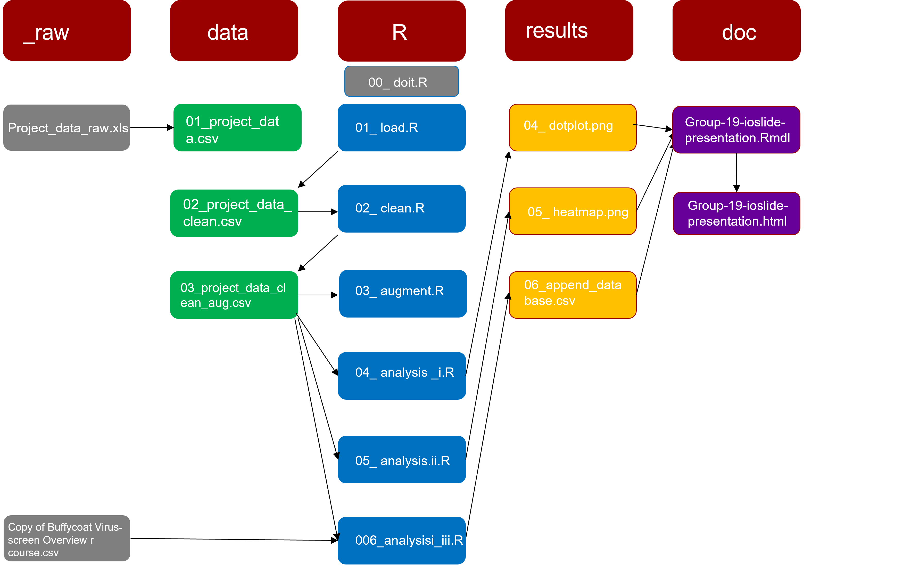
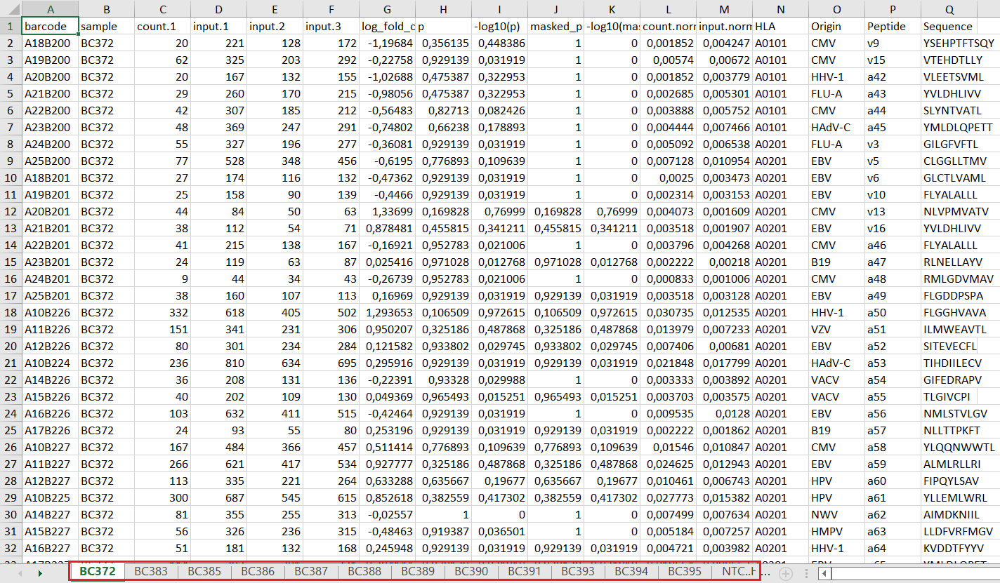
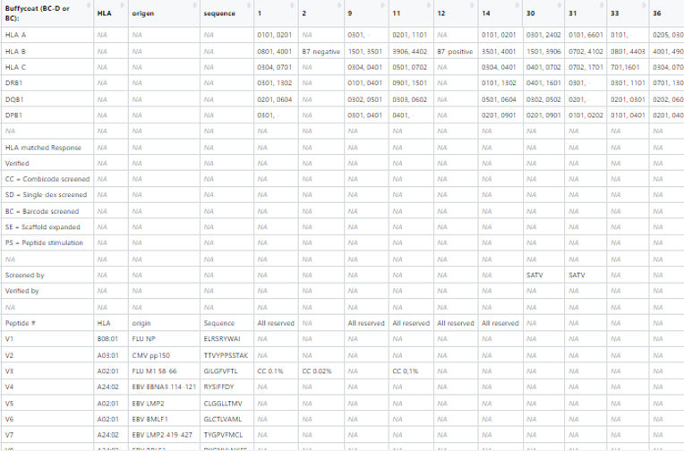
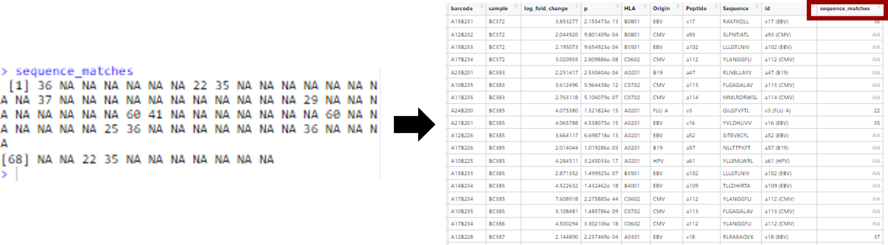
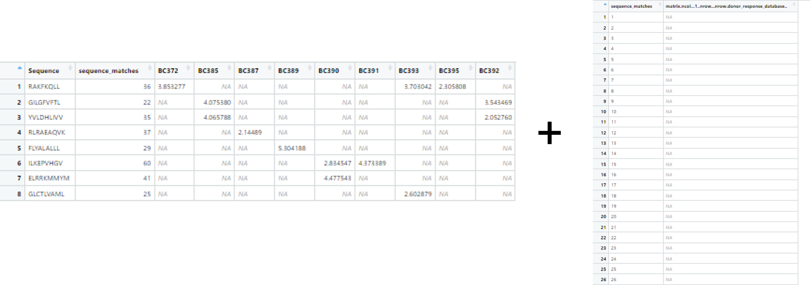
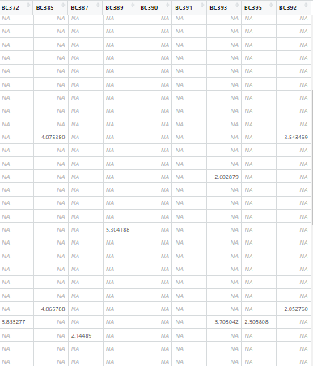

```{r, include = FALSE}
# Load libraries 
suppressPackageStartupMessages(library("tidyverse"))
library("readxl")
library("rmarkdown")
library("knitr")
```


## Introduction {.centered}
- Sequencing -> Barracoda pipeline -> our wrangling + visualization
- Aim: To build a pipeline of data wrangling and visualizations after barracoda pipeline to explore sequence hits

{width=110%}


## Flow chart or flowchart
<br>
<center>
{width=90%}
</center>

## Project data

{width=90%}


## Loading data {.smaller}


```{r}
setwd("/cloud/project")

data <- read_excel("data/_raw/project_data_raw.xlsx")

data
```


## Loading data - merging sheets{.smaller}

```{r}
setwd("/cloud/project")

# Accessing all excel sheets 
sheet <- excel_sheets("data/_raw/project_data_raw.xlsx")

# Creating a list of individual data frames for each sheet
data_frame <- lapply(setNames(sheet, sheet), 
                       function(x) read_excel("data/_raw/project_data_raw.xlsx", 
                                              sheet = x))

# Attaching individual data frames together
data_frame <- bind_rows(data_frame, 
                        .id = "Sheet")
data_frame
```


## Viral responses in multiple samples?
- Goal: Visualize whether specific CD8 T cells that recognize the same viral epitope are found in multiple samples.
<center>
{width=90%}
</center>

## Simple overview of viral responses{.centered}


{width=42%}

## Donor response database 

-The database has a special format

<center>
{width=80%}
</center>


## Appending new responses on the response database

- Remove irrelevant data (log_fold_change >2)
- Match peptides in the database sheet with the the ones from the dataset 
- Assign a database row position to the macthed peptides
- Create a dataframe with the same amount of rows and add matching peptides on corresponing rows
- Append it on the database


## Adding database row positions to matching data
<br>
<br>
<center>
{width=100%}

</center>


## Adding values in the right rows {.vcenter}
<br>
<br>
<br>
<center>
{width=100%}
</center>


## Final product

<center>
{width=50%}
</center>


##
<br>
<br>
<br>
<br>
<br>
<span style="font-family:Ariel; font-size:6em;">Questions?


