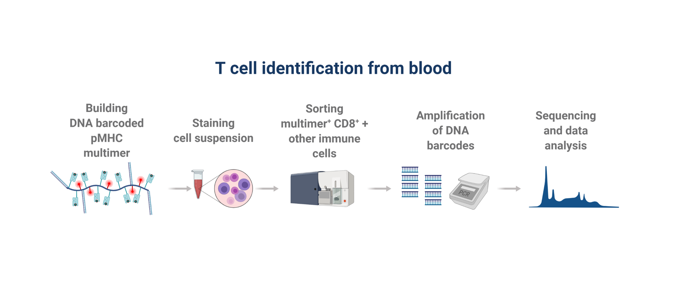

```{r, include = FALSE}
# Load libraries 
suppressPackageStartupMessages(library("tidyverse"))
library("readxl")
library("rmarkdown")
library("knitr")
```


## Project data{.centered}

{width=90%}


## Project data

{width=90%}


## Loading data{.smaller}

```{r}
setwd("/cloud/project")

data <- read_excel("data/_raw/project_data_raw.xlsx")

data
```


## Loading data - merging sheets{.smaller}

sheet <- excel_sheets("data/_raw/project_data_raw.xlsx")

data_frame <- lapply(setNames(sheet, sheet), 
                       function(x) read_excel("data/_raw/project_data_raw.xlsx", sheet = x))

data_frame <- bind_rows(data_frame, 
                        .id = "Sheet")

```{r, echo = FALSE}
# Load data ---------------------------------------------------------------
# Set working directory
setwd("/cloud/project")

# Accessing all excel sheets 
sheet <- excel_sheets("data/_raw/project_data_raw.xlsx")

# Applying sheet names to dataframe names
data_frame <- lapply(setNames(sheet, sheet), 
                       function(x) read_excel("data/_raw/project_data_raw.xlsx", sheet = x))

# Attaching all dataframes together
data_frame <- bind_rows(data_frame, 
                        .id = "Sheet")

# Write data --------------------------------------------------------------
write_csv(x = data_frame,
          file = "data/01_project_data.csv")
data_frame

```


## Flow chart or flowchart


## Data wrangling before plotting log-fold change graph

```{r results = 'hide', message = FALSE, echo = FALSE}
##R code
setwd("/cloud/project")

my_data_clean_aug <- read_csv(file = "data/03_project_data_clean_aug.csv")

```

```{r echo = TRUE}
#Setting the threshold
threshold <- my_data_clean_aug %>% 
  count(Origin) %>% 
  filter(n > 50) %>% 
  count() %>% 
  pull()

#Pooling all groups of vira with less than 50 hits into 'Other'
my_data_clean_aug_pooling <- my_data_clean_aug %>% 
  mutate(Origin = as.factor(Origin)) %>% 
  mutate(newID = fct_lump(Origin, threshold)) %>% 
  mutate(value = case_when(log_fold_change <= 2 ~ 0,
                           0.001 < p & log_fold_change >= 2 ~ 0,
                           0.001 >= p & log_fold_change >= 2 ~ 1))

```


## Slide with Plot

{width=100%}


## Slide with Plot{.centered}

{width=40%}


